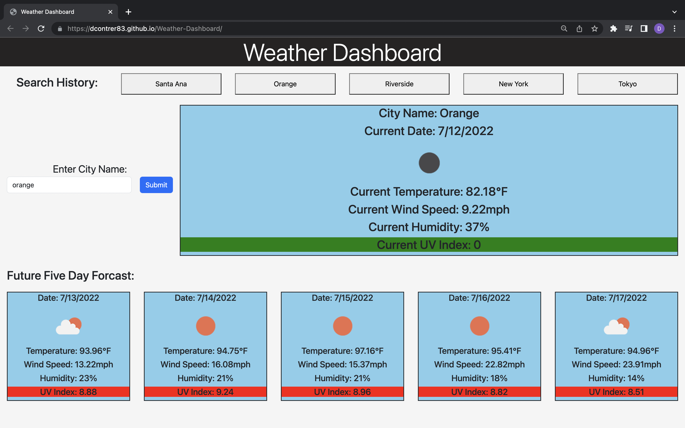

# Weather-Dashboard

<h2>Description</h2>
  

This webpage lets user search a city and then will recieve informtion about that city's forcast (includes date, weather icon, temperature, wind speed, humidity, and uv index.) and future five day forcast. The uv index will be green (favorable) when between 0 and 3 including 0, yellow (moderate) between 3 and 6 including 3, and red (severe) when 6 or higher. There is also a search history section that will include the names of the last five cities searched (no repeat) and when the user clicks the button they will be given said city's forcast and future forcast.

  
<h2>Screenshots<h2>

<h2>Link</h2>

<a href="https://dcontrer83.github.io/Weather-Dashboard/">Weather Dashboard</a>