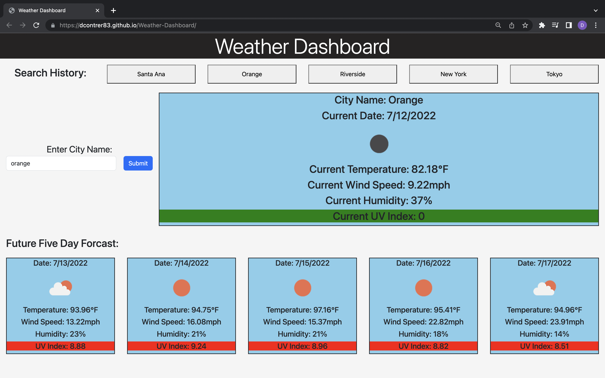

# Weather Dashboard

  

  ## Description

  This webpage lets users search a city and then will receive information about that city's forecast (includes date, weather icon, temperature, wind speed, humidity, and uv index) and future five day forecast. The uv index will be green (favorable) when between 0 and 3 including 0, yellow (moderate) between 3 and 6 including 3, and red (severe) when 6 or higher. There is also a search history section that will include the names of the last five cities searched (no repeat) and when the user clicks the button they will be given said city's forecast and future forecast. Used [OpenWeather One Call API](https://openweathermap.org/api/one-call-api) to get weather information.

  ## Table of Contents
  
  - [Installation](#installation)
  - [Usage](#usage)
  - [Screenshots](#Screenshot)
  - [Walkthrough](#Walkthrough)
  - [Link](#Link)
  - [License](#license)
  - [Questions](#questions)

  ## Installation

  - Install all files from this repo. 

  ## Usage

  Type any city name that you want to see its weather information. If they were the last five searched cities, you can click the button in the search history button to see its weather.

  ## Screenshot

  

  ## Walkthrough

  

  Link of Walkthrough Video: [Weather Dashboard Video](https://drive.google.com/file/d/1jC_E0G8CB-RQYf_FAgIROx7jKzD7-E8D/view)

  ## Link

  [Weather Dashboard](https://dcontrer83.github.io/Weather-Dashboard/)

  ## License

  The license that is used for this project is: MIT License

  For more information please go to: https://choosealicense.com/licenses/mit/

  ## Questions

  GitHub Username: dcontrer83

  Link to GitHub profile: [dcontrer83 GitHub Profile](https://github.com/dcontrer83)

  Email Address: dcontrer83@yahoo.com

